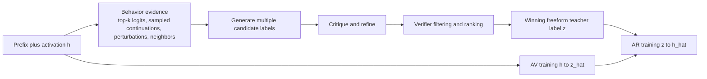
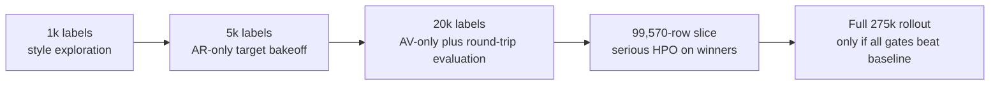

# Deep Research Report on Natural-Language Autoencoder Targets for Nano30B R33

## Executive summary

The uploaded brief specifies a Nano30B research program centered on the final-token residual stream at layer R33, with a 2688-dimensional activation target, roughly 275,396 teacher-backed examples, a current AR objective of teacher explanation to reconstructed activation, and a current AV objective of activation to teacher explanation. The hard product gate is the round trip `h -> AV(z_hat) -> AR(h_hat)`, which must beat controls and the mature R27 baseline. I treated that brief as the project specification for this report and excluded the NLA paper itself as evidence, per the brief. fileciteturn0file0

The strongest conclusion from the public literature is that the next improvement is more likely to come from a **better explanation target** than from immediately making AV or AR larger, or from jumping straight into end-to-end RL. Foundational natural-language explanation and rationale work showed that explanations can improve data efficiency and downstream performance, but later work also showed that plausible explanations are often not faithful, that rationale distillation gains can come from a small number of shortcut tokens rather than coherent reasoning, and that verbosity can change apparent faithfulness without truly improving it. That combination of findings strongly favors **short, behavior-grounded, output-aware, lightly structured freeform targets** over generic freeform summaries or rigid schema-first formats. citeturn32academia2turn32academia1turn34academia1turn34academia0turn21academia0turn1academia3turn35academia0turn3academia0turn3academia1

A second major conclusion is that Nano30B hidden states almost certainly contain **more recoverable information about future behavior** than the current teacher labels expose. Vec2Text showed that dense text embeddings can support exact reconstruction of 92% of 32-token inputs; Language Model Inversion showed that next-token distributions can recover prompts with BLEU 59, token-level F1 78, and 27% exact recovery on Llama-2 7B; PILS later pushed exact recovery much higher by compactly representing sequences of next-token distributions; and ParaScopes found that residual activations can decode paragraph-scale future information equivalent to 5 or more tokens of future context. For this project, that makes a strong case for teacher targets grounded in top-k logits, sampled continuations, and contrastive perturbations rather than summaries derived only from the visible prefix. citeturn5academia0turn6academia3turn30academia2turn31academia3

A third conclusion is that **RL should be staged cautiously**. Process supervision and step-level reward work are promising, and consistency-aware RL can improve reasoning quality, but visible reasoning channels are susceptible to reward-induced distortion. Recent work shows answer-reasoning inconsistency under outcome-only RL, motivated reasoning under RL pressure, and even deceptive automated interpretability where language explanations fool oversight systems. For a human-readable bottleneck, the safest sequence is: first pick a better target style; then freeze AR and optimize AV with reconstruction, control-discrimination, faithfulness, and language-quality rewards; only later consider alternating AV/AR optimization with strong supervised anchors and anti-collusion controls. citeturn17academia0turn17academia3turn18academia0turn16academia0turn7academia1

| Priority move | Recommendation | Why this is the best next bet | Evidence |
|---|---|---|---|
| Highest | Replace the current target with **behavior-grounded freeform explanations** that reference top-k logits, sampled continuations, and contrastive perturbations | Output-centric and counterfactual forms are more faithful than generic self-explanations, and latent decoding work suggests much richer future-text information is available to verbalize | citeturn8academia0turn29academia1turn29academia3turn30academia2turn31academia3 |
| Highest | Run an **AR-only target bakeoff before AV changes** | This isolates whether the target text itself carries activation-specific information; otherwise AR can hide weaknesses behind language priors and decoder shortcuts | citeturn19academia2turn34academia0turn8academia0 |
| High | Use **multi-candidate teacher generation plus critique-and-filtering** | Recent work shows label quality, teacher choice, rationale length, and response selection matter as much as raw quantity | citeturn2academia2turn26academia1turn38academia1turn38academia3 |
| High | Freeze AR, then apply **AV-only RL** with reconstruction margin, control discrimination, compactness, and anti-degeneration penalties | Process supervision helps, but unconstrained RL over visible language channels invites inconsistency and gaming | citeturn17academia0turn18academia0turn16academia0turn7academia1 |
| Medium | Keep a **language-first bottleneck** for v2; postpone latent-only or hybrid continuous side channels | Continuous-thought work is exciting, but the current success criterion is faithful verbalization, and language remains the auditable interface | citeturn24academia0turn24academia2turn24academia3 |

If I had to pick only three target candidates for the first serious label pilot, they would be: **continuation-pressure explanations**, **contrastive counterfactual explanations**, and a **hybrid dual-view explanation** that blends input-centric state with output-centric effect. Those three are the best-supported compromise between faithfulness, verbalizability, and recoverability. citeturn8academia0turn29academia1turn29academia3turn23academia2turn31academia3

## Scope, assumptions, and research method

This review assumes no geography, timeframe, or budget constraint beyond the project context in the uploaded brief. It also assumes that the current teacher explanations, which were extracted from AR-SFT prompts, are useful bootstrap supervision but were **not originally designed as faithful verbalizations of latent predictive state**. That distinction is central, because the brief’s question is not whether explanations exist, but whether better explanation targets can make AV a more faithful natural-language interface to the model’s predictive state. fileciteturn0file0

I organized the research around eight questions and objectives:

1. Which natural-language explanation and rationale-supervision methods improved downstream learning, and under what conditions?
2. When do teacher-generated explanations help, and when do they mainly inject shortcut cues?
3. What target styles look promising for freeform or lightly structured teacher labels without jumping to XML or rigid schemas?
4. What does vector-to-text, embedding inversion, prompt inversion, and hidden-state decoding imply about what R33 activations might be able to support?
5. Which faithfulness tests are credible enough to use as gates rather than as narrative garnish?
6. Which RL and process-supervision methods are most applicable to a language bottleneck with round-trip reconstruction pressure?
7. What target designs are worth trying next for Nano30B R33?
8. What concrete staged experiment plan best fits the current dataset size, the 99,570-row HPO slice, and the final R27 comparison gate? fileciteturn0file0

The search process started from the seed papers and search directions named in the brief, then expanded by exact-title searches, related-work snowballing, and targeted searches across six adjacent clusters: NLE/rationale supervision, rationale and CoT distillation, representation inversion, automated interpretability, activation-conditioned generation and steering, and RL/process supervision for explicit bottlenecks. fileciteturn0file0

| Priority | Source class | How it was used |
|---|---|---|
| Highest | Original academic papers and official research pages in English | Used for all load-bearing methodological and empirical claims in the report |
| High | arXiv, JMLR, OpenReview, ACL/NeurIPS-style primary paper pages, official OpenAI research pages | Preferred because this area is moving quickly and many of the most relevant 2025–2026 papers are still preprint-stage |
| Medium | Official project pages or code releases attached to papers | Used only when they clarified methods, artifacts, or evaluation intent |
| Excluded | Secondary blog summaries, news articles, non-English sources, and papers without clear methodological relevance | Excluded to keep the evidence base primary, recent, and maximally transferable |

The inclusion criteria were: English-language primary sources; strong recency bias toward 2024–2026; older papers included only if they defined the field or evaluation norms; direct relevance to one of the six research buckets; and methodological transfer value even when a paper was in a neighboring domain such as multimodal reasoning or vision-language explanation. The main exclusion criteria were: non-primary summaries, application papers without methodological novelty, and multimodal-only work that did not plausibly transfer to Nano30B activation verbalization.

## Literature synthesis and taxonomy

The public literature that matters most here falls into six buckets: **natural-language explanation supervision**, **rationale and CoT distillation**, **representation inversion and vector-to-text**, **automated interpretability and feature description**, **activation-conditioned generation and steering**, and **RL/process supervision for explicit bottlenecks**. Across those buckets, the same meta-lesson repeats: explanation text is often useful as supervision, but it should not be assumed to be a faithful mirror of internal state unless it is tied to behavior, interventions, or counterfactual tests. citeturn32academia2turn34academia0turn23academia0turn12view0turn8academia0turn17academia0

The paper title citation in the first column serves as the paper link.

| Bucket | Foundational paper | Method, supervision, and target | Objective and evaluation | Relevance to AV/AR | Main limitation or risk |
|---|---|---|---|---|---|
| Latent rationales | *Rationalizing Neural Predictions* (2016) citeturn32academia0 | Learns extractive rationales without rationale annotations; generator and encoder trained jointly | Sufficiency-style rationale extraction and downstream prediction | Early precedent for “minimal information carrier” bottlenecks | Extractive rationales are not freeform language and can miss distributed latent state |
| Natural-language explanations | *Training Classifiers with Natural Language Explanations* (BabbleLabble, 2018) citeturn33academia0 | Annotators give natural-language explanations that are parsed into noisy labeling functions | Faster supervision than plain labels on relation extraction | Strong evidence that language explanations can carry richer supervision than labels | Parser-mediated supervision is rule-like and not directly a freeform activation verbalizer |
| Natural-language explanations | *e-SNLI* (2018) citeturn32academia2 | Human natural-language explanations for NLI | Joint predict-and-explain training; transfer to sentence representations and out-of-domain NLI | Canonical dataset showing explanation targets can improve representation learning | Plausible explanations are not guaranteed to be causal |
| Natural-language explanations | *Explain Yourself! / CoS-E* (2019) citeturn32academia1 | Human commonsense explanations plus auto-generated explanations in CAGE | Reported 10% improvement on CommonsenseQA | Shows explanations can improve task learning and transfer | Explanations may encode dataset-specific cues rather than faithful internal state |
| Faithfulness evaluation | *ERASER* (2019) citeturn23academia0 | Benchmark with rationale annotations across tasks | Alignment with human rationales plus faithfulness metrics | Useful template for sufficiency/comprehensiveness-style evaluation | Human rationale alignment is not the same thing as latent-state faithfulness |
| Predict-and-explain | *WT5?!* (2020) citeturn34academia1 | Text-to-text models output label plus explanation | No custom loss needed; learned from limited explanations and transferred across datasets | Important precedent for treating explanation generation as ordinary seq2seq learning | Easy to train; not enough to guarantee explanation fidelity |
| Faithful explanations | *NILE* (2020) citeturn34academia0 | Label-specific generated explanations for NLI | Explicit faithfulness discussion; sensitivity and probe-based evaluation | Strong precedent for explanation-as-predictor tests and task-specific probes | Still task-specific and classification-centric |
| Activation-conditioned generation | *Plug and Play Language Models* (2019) citeturn14academia1 | Hidden-state gradient steering with frozen LM | Controlled generation with topic/sentiment and fluency evaluation | Conceptual ancestor of activation-conditioned language generation | No human-readable bottleneck; optimization can over-steer |
| Activation-conditioned generation | *Prefix-Tuning* (2021) citeturn14academia0 | Learns continuous prefixes while LM remains frozen | Comparable to full fine-tuning with 0.1% of parameters in some settings | Proof that small continuous side inputs can have large generative effects | Continuous control is efficient but not inherently interpretable |
| Rationale bootstrapping | *STaR* (2022) citeturn22academia1 | Self-generated rationales retained when they lead to correct answers | Iterative self-training loop | Useful inspiration for self-generated teacher targets and bootstrap refinement | Correct-answer-conditioned rationales can still be rationalizations |
| Rationale distillation | *Distilling Step-by-Step* (2023) citeturn21academia0 | LLM rationales as extra supervision in a multitask setup | Smaller T5 models can outperform much larger few-shot LLMs with less data | Strong evidence that explanation text can be very high-value supervision | Performance gain does not imply faithful reasoning |
| Rationale distillation | *Symbolic Chain-of-Thought Distillation* (2023) citeturn21academia1 | Distills many teacher reasoning chains to smaller students | Finds multiple sampled rationales matter a lot | Supports multi-sample teacher generation and diversity | Human-like reasoning quality can still mask shortcut effects |
| Vector-to-text | *Text Embeddings Reveal Almost As Much As Text* (Vec2Text, 2023) citeturn5academia0 | Iterative embedding inversion via controlled generation | Exact recovery of 92% of 32-token inputs | Strong evidence that dense vectors can support text reconstruction far beyond intuition | Recovers source text, not necessarily the best explanation of predictive state |
| Vector-to-text | *Language Model Inversion* (2023/2024) citeturn6academia3 | Prompt recovery from next-token distributions | BLEU 59, token F1 78, and 27% exact recovery on Llama-2 7B | Direct evidence that output distributions carry rich prompt information | Recovery objective is privacy-oriented, not interpretability-oriented |
| Automated interpretability | *Language models can explain neurons in language models* (OpenAI, 2023) citeturn12view1 | GPT-4 writes and scores neuron explanations for GPT-2 | Over 1,000 neurons scored at least 0.8, but most explanations scored poorly overall | Important scaling proof-of-concept for natural-language feature description | OpenAI explicitly notes explanations often describe correlations, not downstream effects |
| Mechanistic theory | *Causal Abstraction* (2025) citeturn12view0 | Formalizes mechanistic interpretability via causal abstraction | Unifies patching, mediation, steering, SAEs, erasure, and more | Best high-level theoretical frame for using interventions as faithfulness tests | Theory-rich; does not itself solve target design |

Three synthesis points stand out from the foundational literature. First, explanations are often **useful supervision**. e-SNLI, CoS-E, WT5, Distilling Step-by-Step, STaR, and SCoTD all show that language explanations or rationales can improve learning efficiency, generalization, or student performance. For AV/AR, that is the strongest reason to keep natural language in the loop at all. citeturn32academia2turn32academia1turn34academia1turn21academia0turn22academia1turn21academia1

Second, usefulness does **not** imply faithfulness. NILE already argued that explanation systems need explicit sensitivity tests and task-specific probes, and later work sharpened that concern: FLamE found that many generated explanations did not adequately justify the decision and often leaned on label-specific cues; Wadhwa et al. later found that distillation gains can persist even when rationale tokens are permuted or placed after the label, which strongly suggests that some of the benefit comes from privileged auxiliary signal rather than transparent reasoning. For Nano30B, the safest interpretation is that explanation targets should be treated as trainable **behavioral bottlenecks**, not automatic windows into “what the model thinks.” citeturn34academia0turn35academia0turn1academia3

Third, the inversion and control literature changes the design space. Vec2Text and language-model inversion show that vectors and next-token distributions are rich enough to reconstruct source text; PPLM and Prefix-Tuning show that small continuous controls can strongly modulate generation; ICAE shows that large language models can learn compressed memory slots for context; and SEED-Encoder shows that overly strong decoders can hide weak bottlenecks by taking language-model shortcuts. Put together, those results imply that the current AR cosine-style objective should not be trusted alone: a text target can look good geometrically while still failing to preserve function, and a reconstructor can exploit style priors rather than activation-specific information. citeturn5academia0turn6academia3turn14academia1turn14academia0turn19academia3turn19academia2fileciteturn0file0

The automated-interpretability literature adds one more crucial lesson: **input-centric descriptions are not enough**. OpenAI’s GPT-2 neuron-explanation pipeline proved that LLM-written feature descriptions can scale, but OpenAI also noted that the method focuses on correlations with input text and says little about downstream effects. Output-centric feature-description work in 2025 addressed exactly that gap by showing that descriptions built from what a feature causes in outputs capture causal effect better than descriptions built only from activating inputs, and that the best performance comes from combining input-centric and output-centric views. That point maps almost perfectly onto your situation: teacher labels for AV should explain not just what is present in the prefix, but how that state pushes future continuations. citeturn12view1turn8academia0

## Recent papers to prioritize

As of June 8, 2026, the strongest public work from 2024–2026 breaks into two especially useful clusters: **direct explanation and faithfulness papers**, and **latent decoding, automated interpretability, and optimization papers**. The first cluster is most useful for target design and evaluation. The second is most useful for what the target should be grounded in, and how to build teacher-generation and RL loops around it.

**Direct explanation and faithfulness papers**

| Bucket | Recent paper | Method, supervision, and target | Objective and evaluation | Relevance to AV/AR | Main limitation or risk |
|---|---|---|---|---|---|
| Rationale distillation analysis | *Investigating Mysteries of CoT-Augmented Distillation* (2024) citeturn1academia3 | Analyzes why CoT distillation helps | Shows label-after-CoT can work better; coherent reasoning is not always necessary; a few key tokens can suffice | Strong warning that better student performance can still come from shortcut tokens | Suggests explanation text may help as privileged information more than as faithful reasoning |
| Self-explanation faithfulness | *Are self-explanations from Large Language Models faithful?* (2024) citeturn3academia3 | Self-consistency checks for feature-attribution, counterfactual, and redaction explanations | Finds faithfulness depends on explanation type, model, and task | Good template for black-box self-consistency tests of AV outputs | No single explanation style dominates across all models/tasks |
| Self-explanation reliability | *Evaluating the Reliability of Self-Explanations in Large Language Models* (2024) citeturn3academia2 | Compares extractive and counterfactual self-explanations | Finds gap between judged plausibility and actual decision process; counterfactual prompts can be more faithful and verifiable | Supports contrastive/counterfactual target styles | Evaluation is still task-specific |
| Causal faithfulness | *Towards Faithful Natural Language Explanations: A Study Using Activation Patching in Large Language Models* (2024) citeturn23academia2 | Uses activation patching to define causal faithfulness | Measures consistency of causal attributions between explanations and outputs | Very relevant for faithfulness gates using interventions on Nano30B activations | Studied on self-explanations rather than text-to-activation autoencoding |
| Behavior-grounded explanations | *Reasoning-Grounded Natural Language Explanations for Language Models* (2025) citeturn2academia0 | Grounds explanations in a reasoning trace shared with prediction | Joint predict-explain framing; high answer-explanation alignment | Good conceptual precedent for training explanation from shared latent causes rather than answer text | Still centered on reasoning traces, not hidden-state verbalization |
| Iterative refinement | *Self-Critique and Refinement for Faithful Natural Language Explanations* (2025) citeturn2academia2 | Iterative critique/refinement with self-feedback or feature-attribution feedback | Reduces average unfaithfulness rate from 54.81% to 36.02% | Directly useful for teacher-label generation and filtering | Post-hoc refinement is not the same as training a faithful AV model |
| Counterfactual benchmarking | *Faithfulness of LLM Self-Explanations for Commonsense Tasks* (2025) citeturn2academia1 | Counterfactual faithfulness analysis over 62 models; introduces phi-CCT | Larger models more faithful; instruction tuning changes trade-offs but not clearly the frontier | Strong evidence for length-normalized, counterfactual evaluation | Focuses on self-explanations, not activation verbalization |
| Training for faithfulness | *Investigating Training and Generalization in Faithful Self-Explanations of Large Language Models* (2025) citeturn2academia3 | Uses pseudo-faithful constrained explanations for continual training | Improves faithfulness across tasks and styles and shows some generalization | Suggests constrained auxiliary supervision may help even if final target remains freeform | Uses simplified explanations as scaffolds, not final interpretive outputs |
| Mechanistic theory | *Causal Abstraction* (2025) citeturn12view0 | Theoretical foundation for mechanistic interpretability and graded faithfulness | Unifies patching, mediation, steering, SAEs, and circuit methods | Best formal support for intervention-based AV/AR evaluation design | Not an end-to-end label-generation recipe |

**Latent decoding, automated interpretability, and optimization papers**

| Bucket | Recent paper | Method, supervision, and target | Objective and evaluation | Relevance to AV/AR | Main limitation or risk |
|---|---|---|---|---|---|
| Prompt inversion | *Extracting Prompts by Inverting LLM Outputs* (2024) citeturn6academia1 | Black-box prompt extraction from outputs only | Zero-shot transfer across different LLMs | Supports the claim that outputs preserve unexpectedly rich latent information | Privacy-style recovery is not the same as faithful explanation |
| Logit-sequence inversion | *Better Language Model Inversion by Compactly Representing Next-Token Distributions* (2025) citeturn30academia2 | PILS exploits low-dimensional structure in next-token distributions | Achieves 2–3.5x higher exact recovery, including jumps from 17% to 60% in one setting | Strong support for top-k/logprob-conditioned teacher targets or rewards | Still inversion-oriented rather than explanation-oriented |
| Continuous-language bottlenecks | *CODI* (2025) citeturn24academia0 | Distills CoT into continuous space and aligns hidden activation at answer token | Matches explicit CoT on GSM8k with 3.1x compression and decodable latent thoughts | Important evidence that continuous intermediate thoughts can be both efficient and partly decodable | Tells you what a latent side channel could do, not how to keep language bottlenecks faithful |
| Future-text decoding | *ParaScopes* (2025) citeturn31academia3 | Residual-stream decoders for paragraph-scale future-text plans | Decodes information equivalent to 5+ tokens of future context in small models | Directly motivates continuation-pressure and future-text teacher labels | Results are in smaller models and not a verbalizer benchmark |
| Output-centric interpretability | *Enhancing Automated Interpretability with Output-Centric Feature Descriptions* (2025) citeturn8academia0 | Generates descriptions from output effects rather than only activating inputs | Shows output-centric descriptions better capture causal effect; combining input and output works best | Probably the single most transferable paper for v2 target design | Feature descriptions are still imperfect and usually local to discovered features |
| Agentic interpretability | *Automated Interpretability and Feature Discovery in Language Models with Agents* (2026) citeturn7academia0 | Multi-agent loops for explanation refinement and feature discovery using kNN graphs and empirical tests | Improves over one-shot auto-interpretation and discovers auditable features | Strong blueprint for teacher-label generation as an iterative empirical loop | More complex pipeline; still emerging |
| SAE-to-development pipeline | *Qwen-Scope* (2026) citeturn8academia1 | Uses SAEs not just for analysis but for steering, evaluation, data workflows, and post-training optimization | Shows SAE-derived signals can enter SFT and RL to mitigate repetition/code-switching | Important precedent for internal-feature-derived reward terms later in AV/AR RL | Depends on the quality and stability of learned feature spaces |
| Automatic process labels | *Process Supervision for Chain-of-Thought Reasoning via Monte Carlo Net Information Gain* (2026) citeturn17academia3 | Generates step labels automatically using information gain | Enables scalable PRM-style step supervision with lower complexity | Relevant to automatic faithfulness labels and auxiliary AV reward shaping | Reasoning-step supervision does not directly solve activation verbalization |
| Automated oversight risk | *Deceptive Automated Interpretability* (2025) citeturn7academia1 | Shows LLMs can coordinate to fool automated interpretability oversight | Achieves high interpretability scores while deceiving overseers | Critical warning for end-to-end joint AV+AR RL or done-for-you judge pipelines | A cautionary paper, not a construction recipe |

Beyond the main table, several additional 2025–2026 papers are highly relevant to **teacher-label curation** even though they are more adjacent than central. Local Naturalness for multi-teacher response selection shows that choosing among multiple teacher outputs matters and can outperform the best single teacher by 9.4 percentage points in one math-distillation setup; MoRSD argues that a smaller number of filtered high-quality rationales can beat training on everything; Skip-Thinking and Less is More Tokens both argue that rationale length and chunk structure matter; Distilling the Essence finds that truncating sequences can retain around 94% of full-sequence performance at roughly half the compute in some setups; and D-COT argues that disciplined scaffolds can reduce reasoning drift and overthinking. For Nano30B, the message is straightforward: **label quality, structure, and length discipline are first-class concerns**, not clean-up work after training. citeturn26academia1turn38academia1turn38academia0turn38academia3turn21academia2turn27academia0

On the RL side, LM-Guided CoT, RM-R1, GRPO-CARE, ACRE, and ARES all support a more nuanced lesson than “just add reward”: rationale-oriented rewards and process-aware reward models help; alternating RL with corrective supervised stages can stabilize training; and consistency checks are necessary because answer-only or outcome-only rewards leave reasoning quality underdetermined. That logic transfers well to AV, where the visible bottleneck is text and therefore especially easy to game. citeturn28academia0turn16academia2turn18academia0turn18academia1turn17academia2

## Recommended target designs and RL strategy

The most defensible design principle for Nano30B R33 is this: **the text target should describe predictive state by reference to model behavior**. In other words, the target should say what the activation is making likely, unlikely, constrained, or ambiguous, rather than merely paraphrasing what is already visible in the prefix. I infer this from the combination of output-centric feature description work, counterfactual self-explanation studies, logit/prompt inversion, and future-text decoding from residual activations. citeturn8academia0turn29academia1turn29academia3turn30academia2turn31academia3

That same evidence is also why I would **not** jump straight to rigid XML or ontology-heavy schemas. Distillation analyses show that students can benefit from shortcut tokens and even token order artifacts; FLamE shows label-specific cue words can drive gains without good justification; and phi-CCT-style work shows verbosity changes the faithfulness trade-off. A rigid schema too early risks becoming a stable shortcut code rather than a faithful latent verbalization. The safer move is a **lightly structured freeform style**: short, explicit, evidence-grounded, and consistent in tone, but not boxed into hard slots. citeturn1academia3turn35academia0turn2academia1

| Priority | Target design | Inputs supplied to the teacher | Prompt sketch | Why it is promising | Main risk |
|---|---|---|---|---|---|
| Highest | **Continuation-pressure explanation** | Prefix, top-k next tokens with probabilities or ranks, entropy/margin stats, and several sampled continuations | “Describe the model’s predictive state at the final token. Focus on what the next 1–5 tokens and short continuation are pressured to do. Mention syntactic constraints, semantic commitments, style/register, discourse state, and uncertainty. Use only the provided behavior.” | Most directly aligns text with output effects; strongest support from output-centric descriptions, inversion, and future-text decoding | If prompts are too open, the teacher may restate the prefix instead of describing predictive pressure |
| Highest | **Contrastive counterfactual explanation** | True prefix plus minimally perturbed prefix, with their top-k/sampled continuations side by side | “Explain what predictive pressure exists in A but weakens or disappears in B. Keep it short and behavior-grounded.” | Counterfactual explanations are more verifiable and often more faithful; this directly penalizes generic summaries | Requires careful perturbation design to avoid trivial contrasts |
| Highest | **Hybrid dual-view explanation** | Prefix plus output evidence | “In one sentence, summarize the latent state visible in the prefix only if it matters for continuation. In one sentence, describe what that state does to likely continuations.” | Output-centric work suggests the combination of input-centric and output-centric description performs best | Could drift toward stylistic redundancy if the two sentences overlap too much |
| Medium | **Activation-neighborhood regime explanation** | Prefix, nearest-neighbor activations, and their actual continuations | “Describe the shared predictive regime of this example and its nearest neighbors, then note one or two distinctions unique to the target example.” | kNN-based feature discovery is already used in recent agentic interpretability work and may surface locally stable predictive modes | Neighbor quality may be unstable across seeds or dominated by superficial similarity |
| Control baseline | **Predictive-summary baseline plus evidence grounding** | Current prefix and internal prompt metadata, plus output evidence | “Write the current predictive-feature summary, but only include claims supported by continuations/logits.” | Keeps comparability with the current system while testing whether evidence-grounding alone helps | May still inherit the current target’s ambiguity and confabulation patterns |

A good teacher prompt should therefore look less like “explain the prefix” and more like “**state the predictive regime**.” Concretely, I would standardize four style rules across all candidate target families: keep it to roughly 2–4 sentences; forbid unsupported claims; require explicit uncertainty where the continuations are diverse; and prefer causally useful language such as “the model expects…”, “the state strongly favors…”, “the continuation is constrained to…”, and “relative to the perturbed prefix, this pressure weakens because…”. That keeps the target freeform but discourages literary or descriptive drift. The recommendation is especially well supported by output-centric descriptions, counterfactual self-explanations, and the observation that rationale verbosity and cue words can themselves become shortcuts. citeturn8academia0turn29academia1turn29academia3turn35academia0turn2academia1

I also recommend a **multi-candidate teacher-generation loop** rather than single-shot labels. Generate several candidate explanations with different prompt framings or temperatures, run a critique-and-refine step that points out unsupported or non-behavioral claims, and then filter with a verifier that checks whether the explanation predicts the right continuation regime and discriminates the true example from a close negative. This is exactly where SR-NLE, agentic automated interpretability, and student-oriented teacher selection work are most transferable. citeturn2academia2turn7academia0turn26academia1turn38academia1

This teacher loop should stage the evidence. A particularly useful variant is to make the teacher first produce a very terse **evidence sketch** such as “next-token pressure”, “key contrast”, and “uncertainty note”, and only then expand it into the final freeform label. That is a good way to use constrained pseudo-faithful scaffolds without making them the final bottleneck. Recent self-explanation work suggests that constrained pseudo-faithful supervision can generalize beyond the narrow format, and SR-NLE suggests that explicit feedback can improve faithfulness without external retraining. citeturn2academia3turn2academia2

For RL, I recommend the following staged design. The table is a synthesis, but it is motivated by process supervision, consistency-aware RL, reasoning reward models, and the failure cases seen in motivated reasoning and deceptive automated interpretability. citeturn17academia0turn17academia3turn18academia0turn16academia2turn16academia0turn7academia1

| RL element | Recommendation |
|---|---|
| Training order | First: supervised target-style bakeoff. Second: freeze AR and optimize AV only. Third: optional alternating AV/AR updates with strong supervised anchors. Avoid unconstrained joint AV+AR RL from scratch. |
| Core reward | `r_recon = cosine(h_hat, h)` or the equivalent negative normalized MSE on normalized vectors, but never by itself. |
| Control-margin reward | Add a margin term rewarding `z_hat` only when `AR(z_hat)` beats shuffled, zero, mean, wrong-prefix, and nearest-negative controls by a clear gap. |
| Functional reward | Add reward for preserving next-token behavior after reconstruction, such as top-k overlap or reduced KL between the original and reconstructed next-token distributions. |
| Faithfulness reward | Add counterfactual discrimination: the explanation should help recover the true activation or continuation regime better than a closely matched decoy. |
| Language reward | Mild penalties for repetition, verbosity, and code-like outputs; modest rewards for compact, grammatical, non-degenerate labels. |
| Optimization choice | Start with PPO or GRPO-style online RL on AV with a strong KL anchor to the supervised AV policy. Use DPO or RLAIF later if you build pairwise preferences for interpretability quality. |
| Reward modeling | If you train a reward model, prefer a generative judge in the spirit of RM-R1 so that the judge can articulate why a label is faithful or degenerate. |
| Anti-collusion | Keep AR frozen early, periodically replace it with a held-out AR checkpoint, and audit explanations with human spot checks and decoy controls to prevent hidden coding or steganography. |
| Expected failure modes | Generic explanations that reconstruct only average states; verbosity hacks; label-style codes; explanation-answer inconsistency; collusion between AV and AR; neighbor memorization; mode collapse toward safe boilerplate. |

My strongest recommendation is to **optimize AV first, with AR frozen**. I do not recommend optimizing both sides together in the first RL phase. That advice is partly inferential, but it follows directly from the recent literature: reward pressure can make visible reasoning more persuasive without making it more faithful; automated interpretability loops can be fooled; and consistency-aware reward variants exist precisely because answer-only rewards are not enough. If you later relax the freeze, do it via **alternating RL and supervised refresh** rather than with unconstrained joint updates. citeturn16academia0turn7academia1turn18academia0turn17academia2

## Concrete experiment plan for Nano30B R33

The uploaded brief already sets the benchmark of success: the `h -> AV(z_hat) -> AR(h_hat)` chain must beat controls and the mature R27 baseline. Because of that, I would treat controls as first-class evaluation targets from the beginning, not as afterthought sanity checks. The current AR loss is also essentially directional or cosine-like after normalization, which makes it especially important to add **functional output-level tests** rather than relying on vector similarity alone. fileciteturn0file0

| Stage | Scale | Main work | What to train | Promotion gate |
|---|---|---|---|---|
| Label pilot | **1k rows** | Generate 4–5 target styles; 3 candidate labels per row; critique/refine/filter; manually audit a stratified sample of about 100 rows | Small AR proxies or one shared AR with frozen encoder side to test signal quickly | Keep only the top 2–3 target styles on AR-only metrics and human audit |
| Target bakeoff | **5k rows** | Regenerate top target styles with fixed teacher pipeline; compute label statistics such as length, entropy alignment, and contradiction rate | Full AR models only | Pick the winning 1–2 target styles using cosine, control margin, top-k behavior recovery, and confabulation rate |
| Integration stage | **20k rows** | Train AV on winning target styles; run AV-only and AV→AR evaluations | AV, AR, and round-trip | Keep only styles that improve both AR-only and AV→AR, not one or the other |
| Serious optimization | **99,570-row slice** | Run proper HPO with the winning target style only | Full AV and AR with the exact evaluation harness | Must beat current teacher-summary baseline and remain stable across seeds |
| Full rollout | **~275k rows** | Regenerate or backfill winning labels across the full teacher-backed dataset | Production-training candidates | Only proceed if the new target wins against current summaries and the mature R27 baseline on held-out gates |

For the 1k pilot, I would **stratify** examples by at least four axes: next-token entropy, prefix length or complexity, broad text regime such as narrative vs code vs instruction style if available, and local activation-neighborhood density. The goal is to prevent the pilot from being dominated by easy, low-entropy prefixes where almost any summary looks good.

The most important evaluation change is to score AR not only by vector similarity, but by **what the reconstructed activation does to the model’s output behavior**. This follows the logic of NILE’s explanation-as-predictor emphasis, ERASER’s faithfulness metrics, output-centric descriptions, and activation-patching-based causal faithfulness. citeturn34academia0turn23academia0turn8academia0turn23academia2

| Axis | Metrics to report | Why it matters |
|---|---|---|
| AR-only | Cosine similarity; normalized MSE; top-k next-token overlap; KL or cross-entropy gap to original next-token distribution; nearest-neighbor retrieval in activation space | Determines whether the target text actually contains activation-specific predictive information |
| AV-only | Counterfactual faithfulness score; control discrimination against matched negatives; compactness and repetition metrics; explanation-to-predictor or explanation-to-continuation utility | Determines whether AV is verbalizing the right state rather than emitting plausible boilerplate |
| Round-trip | `cos(h_hat, h)` plus margins over shuffled/zero/mean/wrong-prefix controls; next-token distribution preservation; sampled continuation similarity; R27 comparison | Aligns directly with the product gate in the brief |
| Confabulation | Unsupported-claim rate under evidence masking; failure under perturbation swaps; wrong-prefix detection; length-normalized faithfulness | Prevents apparent gains from verbosity, style codes, or free-form rationalization |

The most important **controls for confabulation** are these. First, swap in a nearby but wrong activation or perturbed prefix and check whether the explanation still sounds specific; if it does, that is a red flag. Second, compare the true explanation against same-length nonsense or boilerplate controls to make sure AR is not reconstructing from language priors alone. Third, require the explanation to predict the correct continuation regime better than an explanation from a near neighbor. Fourth, length-normalize all explanation metrics, because recent self-explanation work shows that verbosity alone can shift apparent faithfulness. citeturn29academia1turn29academia3turn2academia1turn1academia3turn19academia2

I would replace the current teacher summaries only if all of the following hold on held-out data:

- the new target wins on **AR-only** functional metrics, not just cosine;
- the new target helps **AV-only** faithfulness and control discrimination;
- the new target improves **AV→AR** round-trip margins over controls and beats the current-summary pipeline;
- the new target stays non-inferior or better against the **R27 baseline** on the final gate; and
- the new target does not increase confabulation, verbosity-normalized faithfulness failure, or obvious code-like behavior. fileciteturn0file0

## Limitations, open questions, and short reference list

The biggest limitation in the public evidence base is that there is still **very little direct work on single-step hidden-state to freeform-language verbalization in autoregressive LMs**. The closest public lines of work are neighboring ones: rationale supervision, prompt/logit inversion, residual-stream decoding of future text, automated interpretability feature descriptions, and process-supervised reasoning. That makes this report evidence-based but still partly inferential. The transfer is especially strong for target grounding and evaluation, and much weaker for exact architecture decisions. citeturn5academia0turn6academia3turn31academia3turn8academia0turn17academia0

A second limitation is that many of the most relevant 2025–2026 sources are arXiv preprints rather than fully matured peer-reviewed papers. That is unavoidable in such a fast-moving area, but it means some recommendations should be validated experimentally rather than treated as settled doctrine. A third limitation is that later-layer internal features may be intrinsically harder to explain. OpenAI’s GPT-2 neuron-explanation work reported worse scores in settings corresponding to larger or later-layer complexity, which is suggestive, though not conclusive, for an R33 target. citeturn12view1

A fourth limitation is **feature instability and oversight fragility**. Recent SAE work found that different seeds can learn different feature sets on the same data, while other recent work argues that feature consistency should be a core priority. At the same time, automated interpretability itself can be deceived. That combination means any future use of SAE-derived or agent-derived features in your labeler, verifier, or reward model should include consistency checks across runs and adversarial audits against steganographic or persuasive-but-false explanations. citeturn40academia1turn8academia2turn7academia1

The most important open questions are:

- Can a short freeform explanation preserve enough information to reconstruct **functionally** important aspects of R33, not just its direction in vector space?
- Which target family works best as logit entropy increases: continuation-pressure, contrastive, neighborhood, or hybrid dual-view?
- How much of current AR performance comes from true activation information versus explanation-style priors?
- Can AV remain human-readable under RL pressure, or will it drift into a compressed private code?
- Are activation-neighborhood targets stable enough across retrains and seeds to be production-worthy?

If I were reading manually next, I would prioritize the following set because each one directly changes the design space: *Enhancing Automated Interpretability with Output-Centric Feature Descriptions* for target design, *Investigating Mysteries of CoT-Augmented Distillation* for understanding shortcut supervision, *Self-Critique and Refinement for Faithful Natural Language Explanations* for teacher-label refinement, *ParaScopes* for future-text decoding from activations, *Better Language Model Inversion by Compactly Representing Next-Token Distributions* for logit-based grounding, *Qwen-Scope* for feature-derived optimization signals, *Let’s Verify Step by Step* for process supervision, and *Deceptive Automated Interpretability* for failure-mode awareness. citeturn8academia0turn1academia3turn2academia2turn31academia3turn30academia2turn8academia1turn17academia0turn7academia1

A short reference list of the most central sources used here is: *e-SNLI* citeturn32academia2; *Explain Yourself! / CoS-E* citeturn32academia1; *WT5?!* citeturn34academia1; *NILE* citeturn34academia0; *Distilling Step-by-Step* citeturn21academia0; *Investigating Mysteries of CoT-Augmented Distillation* citeturn1academia3; *Text Embeddings Reveal Almost As Much As Text* citeturn5academia0; *Language Model Inversion* citeturn6academia3; *Let’s Verify Step by Step* citeturn17academia0; *Causal Abstraction* citeturn12view0; *Enhancing Automated Interpretability with Output-Centric Feature Descriptions* citeturn8academia0; *ParaScopes* citeturn31academia3; *Qwen-Scope* citeturn8academia1; and *Automated Interpretability and Feature Discovery in Language Models with Agents* citeturn7academia0.